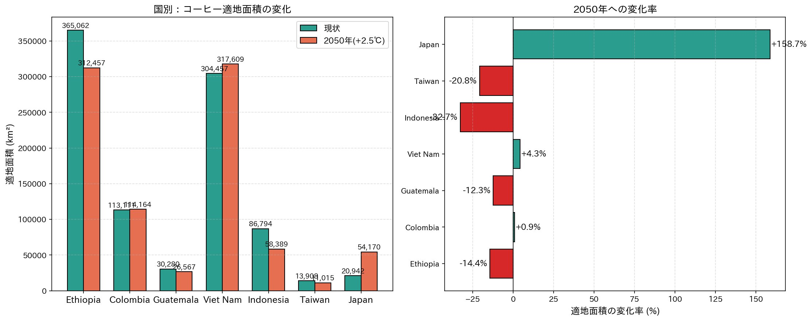
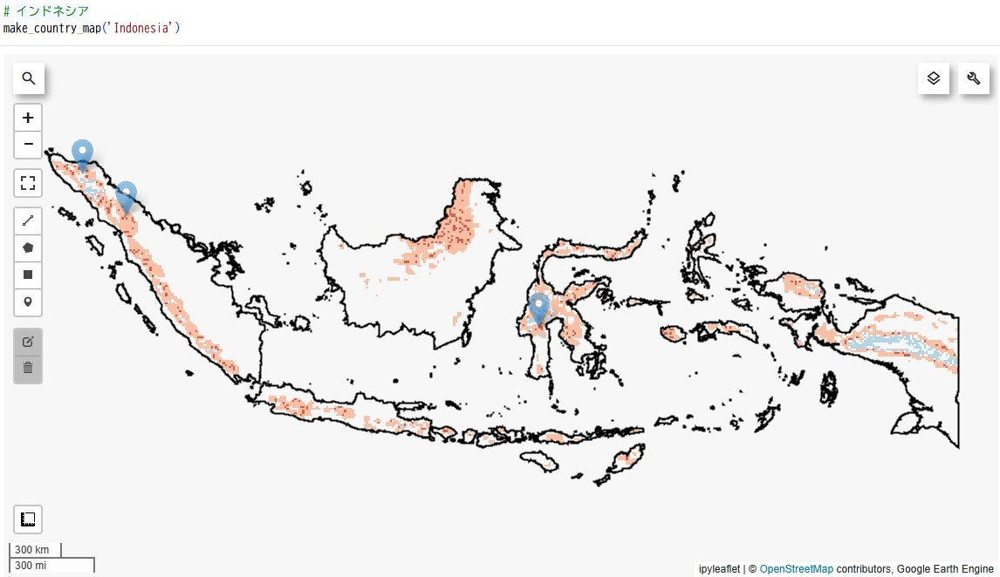
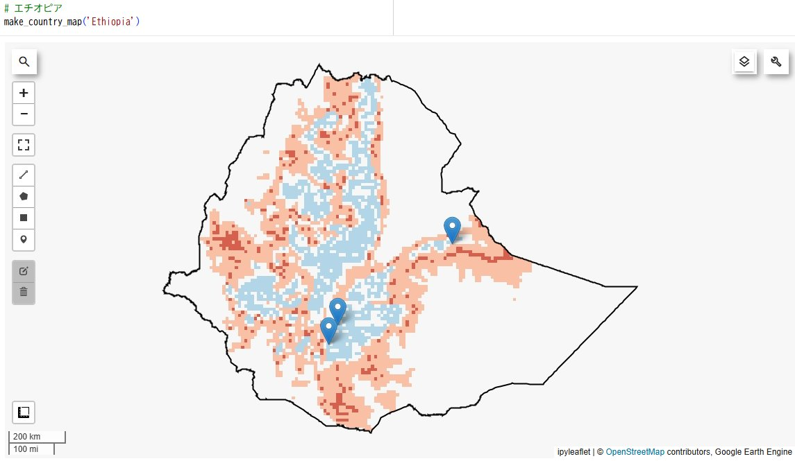
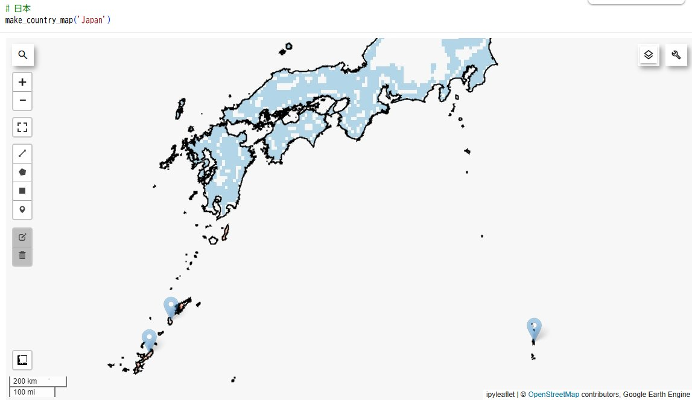
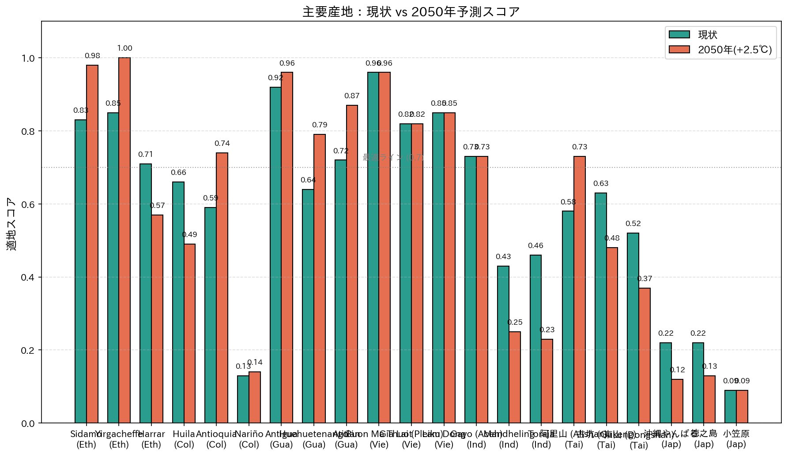

# ☕ コーヒー2050年問題 ― 7カ国の未来地図
## ― 衛星データで見る、コーヒー産地の世界的再編 ―

> **Frontier Academy Fukuoka 卒業制作（2026年6月）**  
> 作成者：森山 光明（Mitsuaki Moriyama）

---

## 🌍 このプロジェクトについて

2050年までに、**現在のアラビカコーヒー栽培地の約50%が栽培不適地になる**と予測されています（Bunn et al., 2015）。  
通称「**コーヒー2050年問題**」。本プロジェクトでは、世界の主要コーヒー生産国 **7カ国** を対象に、**現状の適地と2050年の予測適地を衛星データから可視化**し、産地の地理的再編の実態を明らかにしました。

### 対象7カ国

| 国 | 主な栽培種 | 役割 |
|---|---|---|
| 🇪🇹 エチオピア | アラビカ | アラビカ発祥の地・スペシャルティの聖地 |
| 🇨🇴 コロンビア | アラビカ | 世界第3位の生産国・スタバ主要調達国 |
| 🇬🇹 グアテマラ | アラビカ | 中米スペシャルティの代表 |
| 🇻🇳 ベトナム | ロブスタ | 世界第2位・ロブスタの王様 |
| 🇮🇩 インドネシア | アラビカ | マンデリン・トラジャの故郷 |
| 🇹🇼 台湾 | アラビカ | 阿里山等の高山アラビカ新興地 |
| 🇯🇵 日本 | アラビカ | 沖縄微量栽培・将来の可能性 |

---

## 🎯 なぜこのテーマを選んだか

私は卒業前の18年間、スターバックスコーヒージャパンで店長として勤務してきました。エチオピア・シダモ、コロンビア・ウイラ、グアテマラ・アンティグア、インドネシア・スマトラ……。  
毎日、世界中のコーヒーをお客様に提供してきました。

しかし「あのカップに入っているコーヒーは、これから先も同じ味で飲めるのだろうか？」――この問いに、現場では答えられませんでした。

職業訓練校でPythonとデータ分析を学ぶうちに、**衛星データを使えば、地球規模で「コーヒーの未来」を見られる**と気づき、このテーマに辿り着きました。

> 18年間「カップの中のコーヒー」を見つめてきた私が、これからは「地球上のコーヒー」を見つめる。  
> その視点の転換を、データで実現したのが本プロジェクトです。

---

## 🛰️ 使用データ

すべて **Google Earth Engine（GEE）** から取得した、無料で公開されている衛星・気候データを使用しています。

| データ | プロダクト | 解像度 | 用途 |
|---|---|---|---|
| 標高 | SRTM (USGS) | 30m | DEM（数値標高モデル） |
| 気温 | ERA5-Land | 約11km | 年平均気温（2020-2024平均） |
| 降水量 | CHIRPS | 約5.5km | 年降水量（2020-2024平均） |
| 植生 | Sentinel-2 SR | 10m | NDVI（光合成活性指標） |
| 国境 | FAO GAUL 2015 | - | 国境ポリゴン |

---

## 🌱 アラビカとロブスタ ― 二種の適地モデル

コーヒーには**アラビカ種**（高品質・低耐性）と**ロブスタ種**（低標高・高温耐性）の二大商業品種があります。それぞれ全く異なる適地条件を持つため、本プロジェクトでは**二種類の閾値モデル**を実装しました。

| 要素 | アラビカ最適範囲 | ロブスタ最適範囲 |
|---|---|---|
| 標高 | 1500〜2200m | 200〜800m |
| 年平均気温 | 18〜22℃ | 22〜30℃ |
| 年降水量 | 1200〜1800mm | 1500〜2500mm |

出典：ICO（国際コーヒー機関）, DaMatta et al. (2007), Bunn et al. (2015)

### 2050年シナリオ

IPCC AR6（2021）のSSP2-4.5シナリオに基づき、**気温を一律 +2.5℃** シフトさせた仮想2050年データに同じ閾値モデルを適用しました。これにより、現状と将来の適地分布を直接比較できます。

---

## 📊 主要結果

### 結果1：国別の適地面積変化



| 国 | 現状適地(km²) | 2050適地(km²) | 変化率 |
|---|---|---|---|
| 🇯🇵 日本 | 20,942 | 54,170 | **+158.7%** ⬆️⬆️⬆️ |
| 🇻🇳 ベトナム | 304,457 | 317,609 | +4.3% ⬆️ |
| 🇨🇴 コロンビア | 113,111 | 114,164 | +0.9% → |
| 🇬🇹 グアテマラ | 30,280 | 26,567 | -12.3% ⬇️ |
| 🇪🇹 エチオピア | 365,062 | 312,457 | -14.4% ⬇️ |
| 🇹🇼 台湾 | 13,908 | 11,015 | -20.8% ⬇️⬇️ |
| 🇮🇩 インドネシア | 86,794 | 58,389 | **-32.7%** ⬇️⬇️⬇️ |

### 結果2：3つの未来パターン

7カ国の差分マップを分析した結果、コーヒー産地の未来は**3つのパターン**に分類できることが分かりました。

#### パターン①：消える産地 ― インドネシア



ほぼ全島がピンク〜赤で覆われ、青色（改善エリア）はほぼ皆無。
- スマトラ北部のGayo・Mandheling、スラウェシのTorajaなど**スペシャルティアラビカの聖地が軒並み壊滅**
- 適地面積 **-32.7%**（最大ダメージ）
- 主要産地スコア：Mandheling 0.43 → **0.25**、Toraja 0.46 → **0.23**

#### パターン②：移動する産地 ― エチオピア



**南西部に大きな青エリア、東部・南東部に大きな赤エリア。** 同じ国の中で明暗が真っ二つに分かれる。
- 南西部のSidamo・Yirgachefeは**完璧化**（Yirgacheffe 0.85 → **1.00**）
- 東部の乾燥地Harrarは**衰退**（0.71 → 0.57）
- 適地面積 **-14.4%**

→ 国内で**産地の地理的シフト**が起きる。

#### パターン③：生まれる産地 ― 日本



**本州・四国・九州の山岳地帯一面に青色が広がる。** 沖縄・小笠原の現主要産地は変化なしまたは悪化。
- 沖縄やんばる 0.22 → **0.12**（既存産地は気温過剰で衰退）
- しかし**現在は寒すぎてコーヒー栽培不可だった日本本土の山岳・内陸地帯**が、+2.5℃で適温化
- 適地面積 **+158.7%**（最大増加率）

→ **2050年、日本本土でコーヒーが栽培できる時代が到来する可能性**。

### 結果3：主要産地21地点の検証

各国の主要産地3地点ずつ、計21地点の適地スコアを現状と2050年で比較しました。



#### 注目すべき変化

**🔥 大きく上がる（気候変動の勝者）**
- Yirgacheffe（エチオピア）：0.85 → **1.00** ＝完璧化
- Sidamo（エチオピア）：0.83 → 0.98
- 阿里山（台湾）：0.58 → **0.73** ＝最適ラインを突破

**📉 大きく下がる（気候変動の敗者）**
- Mandheling（インドネシア）：0.43 → **0.25**
- Toraja（インドネシア）：0.46 → **0.23**
- Huila（コロンビア最大産地）：0.66 → **0.49** ＝最適ライン割れ
- 沖縄やんばる（日本）：0.22 → **0.12**

**🔄 横ばい・微変化**
- Antigua（グアテマラ）：0.92 → 0.96
- Buon Ma Thuot（ベトナム最大ロブスタ産地）：0.96 → 0.96

---

## 🔥 スターバックス調達戦略への示唆

スターバックスは世界30カ国以上から豆を調達し、エシカル調達（C.A.F.E.プラクティス）を通じて農家と直接関係を築いています。本分析が示唆するのは：

### 1. 「単純な減少」ではなく「地理的再編」が起きる
適地面積が減るだけでなく、**国内・国際的に産地がシフト**する。調達戦略は「いま買っている産地を守る」から「将来買う産地を見つける」へ転換が必要。

### 2. 国別の優先度を変える必要性
- **守るべき国**：エチオピア（南西部にシフト）、コロンビア（高地へシフト）
- **新規開拓を検討**：日本本土（新しい産地候補）、台湾高山
- **代替産地を急ぐ**：インドネシア（ダメージ最大）

### 3. 衛星データが核となる調達リスク管理
産地ごとの気候ストレスを継続的にモニタリングし、5〜10年先を見据えた調達計画を立てることが、サプライチェーンレジリエンスの鍵となる。

### 4. 既存研究との整合性
本プロジェクトの結果は、Moat et al. (2017) のエチオピア研究（高標高への産地シフトで緩和可能）、Bunn et al. (2015) の世界予測（既存産地の約50%が不適化）と整合的。**簡易閾値モデルでも、既存研究と一致する傾向を捉えられる**ことが示せた。

---

## 🛠️ 技術スタック

- **Python 3.11**
- **Google Earth Engine API** ― 衛星データ取得・処理
- **geemap** ― インタラクティブマップ可視化
- **pandas / numpy** ― データ処理
- **matplotlib / japanize-matplotlib** ― グラフ作成
- **Google Colab** ― 実行環境

---

## 📂 リポジトリ構成

```
coffee-2050-projection/
├── coffee_2050_projection.ipynb     ← メインNotebook
├── requirements.txt                  ← 必要ライブラリ
├── README.md                         ← このファイル
└── outputs_2050/
    ├── area_change_comparison.png   ← 国別面積変化グラフ
    ├── region_score_comparison.png  ← 主要産地スコア比較
    ├── japan_diff.png               ← 日本：差分マップ
    ├── indonesia_diff.png           ← インドネシア：差分マップ
    └── ethiopia_diff.png            ← エチオピア：差分マップ
```

### 関連リポジトリ
- [ethiopia-coffee-suitability](https://github.com/Mitsuaki-1004/ethiopia-coffee-suitability)：本プロジェクトの第1段階（エチオピア単独の現状分析）

---

## 🚀 使い方

### 1. Google Cloud プロジェクトの準備
Google Earth Engineを使うには、Google Cloudプロジェクトとアース・エンジンの登録が必要。

### 2. ライブラリのインストール
```bash
pip install -r requirements.txt
```

### 3. Notebookの実行
`coffee_2050_projection.ipynb` を Google Colab または Jupyter で開き、冒頭の `project='your-gee-project-id'` を自分のプロジェクトIDに書き換えて実行。

---

## 🎓 限界と今後の課題

### 本プロジェクトの限界

1. **気温一律 +2.5℃ シフトの簡略化** ― 実際の気候変動は地域不均一。本来はCMIP6のダウンスケーリングデータを使うべき
2. **降水量の将来変化を考慮していない** ― 一部地域では降水パターンの変化が気温より大きな影響を持つ可能性
3. **閾値モデルの単純さ** ― 土壌・斜面方位・霜害頻度などは未考慮
4. **NDVIの限定的役割** ― 植生一般しか検出せず、コーヒー樹そのものの分類はできていない

### 今後の発展

- CMIP6データによる地域別ダウンスケーリング
- 降水量変化シナリオの統合（IPCC複数シナリオ比較）
- 機械学習による閾値モデルの精緻化
- コーヒー樹の自動分類（Sentinel-2＋教師データ）
- ブラジル・ホンジュラス等の他主要産地への展開

---

## 💭 個人的な学び

職業訓練校に通い始めた2025年12月、私はPythonの「Hello, World!」から始めました。  
それから半年で、衛星データから世界7カ国のコーヒー産地の未来を予測できるようになりました。

**できないことが、できるようになっていく** ―― この感覚は、スターバックスで新人を育てていた時に何度も見てきたものです。今度は自分自身が、それを体験しています。

そして今回、データが示してくれた最も衝撃的な事実：

> 2050年、いま私たちが当たり前に飲んでいるコーヒーの多くは、別の場所で作られているかもしれない。  
> でも、なくならない。場所を変えて、コーヒーは生き続ける。

これは絶望の物語でも、楽観の物語でもなく、**「適応の物語」**です。  
そしてその適応を支えるのが、衛星データであり、データを読み解く人間であり、その間をつなぐ「現場を知る人間」だと、私は信じています。

18年間カップを通してコーヒーを伝えてきた私が、これからはデータを通してコーヒーの未来を伝えていく。  
このプロジェクトは、その新しい旅の始まりです。

---

## 📚 参考文献

1. Bunn, C., Läderach, P., Ovalle Rivera, O., & Kirschke, D. (2015). *A bitter cup: climate change profile of global production of Arabica and Robusta coffee.* **Climatic Change, 129**, 89–101.
2. Moat, J., Williams, J., Baena, S. et al. (2017). *Resilience potential of the Ethiopian coffee sector under climate change.* **Nature Plants, 3**, 17081.
3. Davis, A.P., Chadburn, H., Moat, J., O'Sullivan, R., Hargreaves, S., & Lughadha, E.N. (2019). *High extinction risk for wild coffee species and implications for coffee sector sustainability.* **Science Advances, 5**, eaav3473.
4. DaMatta, F.M., Ronchi, C.P., Maestri, M., & Barros, R.S. (2007). *Ecophysiology of coffee growth and production.* **Brazilian Journal of Plant Physiology, 19(4)**, 485–510.
5. IPCC (2021). *Climate Change 2021: The Physical Science Basis.* Sixth Assessment Report.
6. ICO (International Coffee Organization) — 各種公開レポート

### データソース
- USGS SRTM: https://www2.jpl.nasa.gov/srtm/
- ECMWF ERA5-Land: https://www.ecmwf.int/en/era5-land
- CHIRPS: https://www.chc.ucsb.edu/data/chirps
- Copernicus Sentinel-2: https://scihub.copernicus.eu/
- FAO GAUL 2015: https://data.apps.fao.org/

---

## 📬 Contact

森山 光明（Mitsuaki Moriyama）  
GitHub: [@Mitsuaki-1004](https://github.com/Mitsuaki-1004)

---

*このプロジェクトは Frontier Academy Fukuoka の卒業制作として、2026年6月に作成されました。*  
*7カ国のコーヒーと、衛星と、18年の現場経験を一つの未来予測に紡ぐ試みです。*
